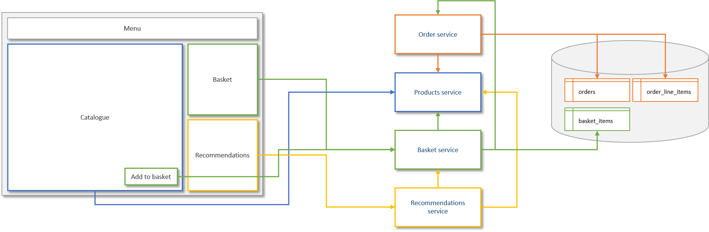

# Congo - an exercise in using Angular, micro-services and micro-frontends

This project is designed to support investigation and prototyping of 
an Angular application that uses a number of microservices. While 
this version is reasonably interesting in itself, it is really 
designed to act as a starting point and reference for developing a 
more advanced version that adopts the "Micro frontends" pattern:

[Micro frontends (martinfowler.com)](https://martinfowler.com/articles/micro-frontends.html)

The project consists of many parts:

+ An Angular web application (portal)
+ A number of microservices
    + Products
    + Basket
    + Orders
    + Recommendations
+ A single database that supports the services

All of these components are setup to run in docker containers using
docker-compose to manage links and dependencies.

The interaction between the components can be visualised with a 
number of diagrams.

Firstly, the standard catalogue (shopping) view:



Secondly the order (history & details) views:


## Challenges

### 1. Externalise the orders module

The orders module contains a number of components, a service and its
own subset of routes. In this version of the application the module is
very much part of the application, but I want to _"externalize"_ it
so that it can be hosted on a different server/container and loaded
dynamically at runtime (rather than build time).

__*But why?*__

In a complex micro-service environment there are likely to be a number 
of modules that are 'owned' by different teams and those teams should 
be able to deploy new versions of their modules without having to rebuild 
and redeploy the portal. Those modules will also be tracked in their
own code repositories and benefit from their own CI/CD pipelines.

In many cases, such as this Orders module, other than integrating with 
the overall portal application via menus and routing there may be  
little interaction between the components in these feature modules 
and components in other modules.

### 2. Externalise the basket & recommendations components

These parts of the application are not currently organised into their
own modules, but they should be treated as feature modules in the
longer term and externalised for the same reasons as described above for
the orders module.

Unlike the components within the orders module, the basket and recommendations
components are more likely to interact with other components on the same
page. For example, the "Add to basket" button needs to sit within the catalogue 
view and the basket needs to update in real time when that button is pressed. 
Likewise, as the basket content changes, the recommendations component needs to 
update automatically.

So I need to figure out how to build and integrate external components that
can interact with other components from outside of their own module and still
benefit from independent development and delivery.

### 3. Implement a "store" within the application / modules

The current state management implementation is somewhat naive. In practice
a complex Single Page Application is likely to use some sort of state
container - something like [Redux](https://redux.js.org/) or
[Akita](https://netbasal.gitbook.io/akita/) for example.

We need to implement a proper state management pattern - preferably Akita.


## Quickstart

The easiest way to get everything running is to use the following
commands:

```bash
docker-compose build
docker-compose up
```

The first command will build all the images and might take some
time as it will likely have to download a lot of docker images and
Javascript/Python packages (using npm for the portal and pip 
for the backend services).

The second command will start up all of the containers taking care of
dependencies etc.

The database schema will get setup by the services automatically, but if
you want to change the models then you will need to do that manually or,
at least, drop the tables so they get recreated by the services. You
can access the database within the mysql container like this:

```bash
# docker-compose exec mysql bash
# mysql -u congo -p mongo 
(password = mongo123)

mysql> SHOW TABLES;
+------------------+
| Tables_in_congo  |
+------------------+
| basket_items     |
| order_line_items |
| orders           |
+------------------+
3 rows in set (0.00 sec)

mysql> exit
Bye

# exit
```


## Frequently asked questions

#### Why Congo?

I'm no geographer, but apparently the Congo is the second largest tropical 
rainforest in the world. Second place is still pretty good...

#### Why can I place an order without paying?

You're very welcome!

#### The recommendations seem a bit arbitrary...

Agreed - it's a simplistic and somewhat random algorithm. 

Loosely speaking, what it does is search for products based on matching 
words from the descriptions but ignoring short words. Basically, it's 
over-complicated nonsense - look at the code in the recommendations service 
and see for yourself.

#### Speaking of the product descriptions ... they're a bit weird!

Thank you - I'll take that as a compliment. 

If you're looking for an alternative to standard Lorem Ipsum text 
for your own projects you might want to try this site:

+ [Lorem Ipsum Generators](https://loremipsum.io/ultimate-list-of-lorem-ipsum-generators/)

P.S. I haven't noticed anything _naughty_ in the generated text I used
but if there is something then I apologise. Let me know and I'll clean
it up.

#### I still don't like the product descriptions - can I generate my own?

Yes you can. Take a look in the `tools/products` folder. It contains
a ruby script that uses the popular 
[Faker](https://github.com/faker-ruby/faker)
gem. The folder has a readme with instructions.

Just copy the JSON you generate to `services/products/products.json` 
and you're good to go!

If you don't like ruby you could easily write an alternative 
as faker has been reproduced for a number of different languages:

+ _[Faker for Python](https://faker.readthedocs.io/en/stable/)_
+ _[Faker for Javascript](http://marak.github.io/faker.js/)_
+ _[Faker for PHP](https://github.com/fzaninotto/Faker)_
+ _[Faker for Perl](https://metacpan.org/pod/Data::Faker)_
+ _[Faker for C#](https://github.com/oriches/faker-cs)_
+ _[Faker for Java](https://github.com/DiUS/java-faker)_

_As you can see, there's no excuse for boring test data!_

#### It doesn't support multiple customers - that's just ridiculous!

It's just a spike...but feel free to fork the project and satisfy
that itch yourself if you like.

#### Why are there no unit tests?

Please refer to the previous point.

#### Those services don't seem very resilient...

You're absolutely correct - well spotted! Please refer to the previous
point.

#### You should never let microservices share a database!

Once again, you are correct. But, remember, this is just a spike.

#### Why Angular rather than React or VueJS

I just happened to be working on an Angular project. Would love to redo
it in VueJS (definitely) and React (maybe) if I can find the time.

#### Why Python / Flask for the services rather than x, y or z?

Python & Flask were things I hadn't used before and it's always 
fun to try something new. 

The other options I considered were:

+ NodeJS - a great option for a simple API
+ .NET Core - a definite contender ... maybe next time
+ Sinatra - another great option ... almost went for that 'cos I do love Ruby
+ Ruby on Rails - probably a bit heavyweight for a spike
+ Laravel - like Rails ... probably a bit heavyweight for a spike
+ Slim - probably ok but I very much doubt I'd use it in the future
+ Java / Springboot - definitely too heavyweight for a spike and really needs a decent IDE
